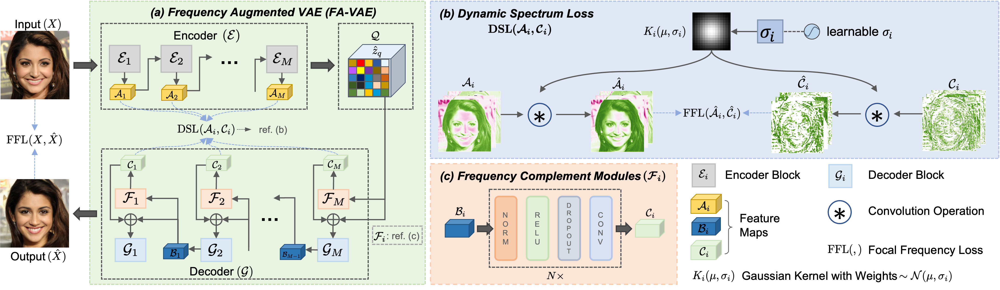

# Frequency Augmented VAE (FA-VAE)
This is the original implementation for the paper ["Catch Missing Details: Image Reconstruction with Frequency Augmented Variational Autoencoder"](https://openaccess.thecvf.com/content/CVPR2023/papers/Lin_Catch_Missing_Details_Image_Reconstruction_With_Frequency_Augmented_Variational_Autoencoder_CVPR_2023_paper.pdf) published in CVPR 2023.

FA-VAE is a model that reconstructs images through improving alignment on the frequency spectrums between the original and reconstructed images.

<!--  -->


## To-Do
~~We will be releasing the checkpoints shortly.~~


## Requirements
The packages needed are in `environment.yaml` for reference.

# Checkpoints

| Model      | Link |
| ----------- | ----------- |
| FA-VAE on CelebA-HQ (Table 2 row 8, FCM (Res) + non pair-wise DSL)      | [expe_5.pt](http://download.innopeaktech.com/public/fa_vae/celeba-5.pt)       |
| FA-VAE on FFHQ (Table 1 row 3)    | [favae-ffhq.pt](http://download.innopeaktech.com/public/fa_vae/ffhq.pt)       |
| FA-VAE on ImageNet (f=16) (Table 1 last row) | [favae-imagenet-f16.pt](http://download.innopeaktech.com/public/fa_vae/imagenet-f16.pt) |
| FA-VAE on ImageNet (f=4) (Table 1 row 6) | [favae-imagenet-f4.pt](http://download.innopeaktech.com/public/fa_vae/imagenet-f4.pt) | 
| CAT on CelebA-HQ | [cat_celeba.pt](http://download.innopeaktech.com/public/fa_vae/CelebA_CAT.pt) |


# Data Preparation 

## CelebA-HQ
1. Download the dataset:

    - CelebA-HQ dataset can be downloaded from [CelebA-Mask-HQ](https://github.com/switchablenorms/CelebAMask-HQ). 
    
    - The train test split is in the file `list_eval_partition.txt`, in [CelebA](http://mmlab.ie.cuhk.edu.hk/projects/CelebA.html) where "0" is train, "1" is eval, and "2" is test.

    - Download the captions from [MM-CelebA-HQ](https://github.com/IIGROUP/MM-CelebA-HQ-Dataset) dataset for training T2I generation.

2. Preprocess the data files in the pkl format.
    ```shell
    cd datasets
    python preprocess_celeba.py
    ```

FFHQ can be downloaded from [FFHQ](https://github.com/NVlabs/ffhq-dataset), ImageNet can downloaded from [Kaggle](https://www.kaggle.com/competitions/imagenet-object-localization-challenge/data).


# Train FA-VAE
FA-VAE comes with different architectures for Frequency Complement Module (FCM) and different settings for the losses Spectrum Loss (SL) and Dynamic Spectrum Loss (DSL). 

1. FA-VAE on CelebA-HQ with different settings of FCM and SL/DSL can be found in the script `train_favae_celeba.sh`. These settings are for the Table 2.
    ```shell
    cd favae_scripts
    bash train_favae_celeba.sh
    ```

2. FA-VAE on FFHQ, ImageNetcan be found in the script 
`train_favae_other_datasets.sh`
    ```shell
    cd favae_scripts
    bash train_favae_other_datasets.sh
    ```

To resume training, the arguments `--resume` and the path for the argument `--resume_path` should be provided. For instance, to resume FA-VAE codebook training on ImageNet
```shell
torchrun --nnodes=1 --nproc_per_node=2 train_vqgan_ddp.py --ds $OUTPUT --batch_size 2 --print_steps 5000 --img_steps 20000 --codebook_size 16384 --disc_start_epochs 1 --embed_dim 256 --use_lucid_quantizer --use_cosine_sim --with_fcm --ffl_weight 1.0 --use_same_conv_gauss --ffl_weight_features 0.01 --gaussian_kernel 9 --codebook_weight 1.0 --perceptual_weight 1.0 --disc_weight 0.75 --base_lr 2.0e-6 --train_file ../datasets/pkl_files/imagenet_train_wo_cap.pkl --val_file ../datasets/pkl_files/imagenet_test_wo_cap.pkl --resume --resume_path $RESUME_PATH
```


# Train CAT Models
1. CAT for T2I generation on CelebA
    ```shell
    cd cat_scripts
    bash script_gpt_CA_celeba.sh
    ```

## BibTeX

```
@inproceedings{favae2023cvpr,
  title={Catch Missing Details: Image Reconstruction with Frequency Augmented Variational Autoencoder},
  author={Lin, Xinmiao and Li, Yikang and Hsiao, Jenhao and Ho, Chiuman and Kong, Yu},
  booktitle={Proceedings of the IEEE/CVF Conference on Computer Vision and Pattern Recognition},
  year={2023}
}
```

## License
See the [LICENSE](LICENSE.md) file for license rights and limitations (MIT).

## Acknowledge
The implementation of FA-VAE relies on resources from [Clip-Gen](https://github.com/HFAiLab/clip-gen), [taming-transformers](https://github.com/CompVis/taming-transformers), [CLIP](https://github.com/openai/CLIP), [vector-quantize-pytorch](https://github.com/lucidrains/vector-quantize-pytorch), [PerceptualSimilarity](https://github.com/richzhang/PerceptualSimilarity/tree/master/models), and [pytorch-fid](https://github.com/mseitzer/pytorch-fid). We thank the original authors for their open-sourcing.